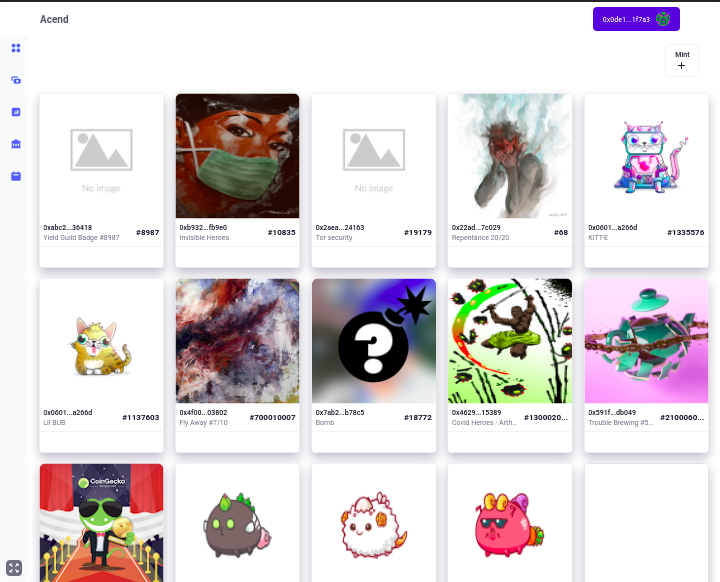
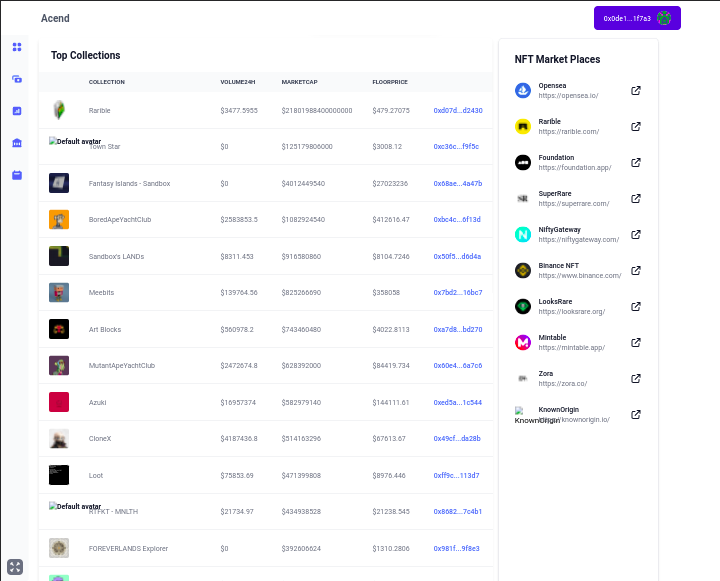
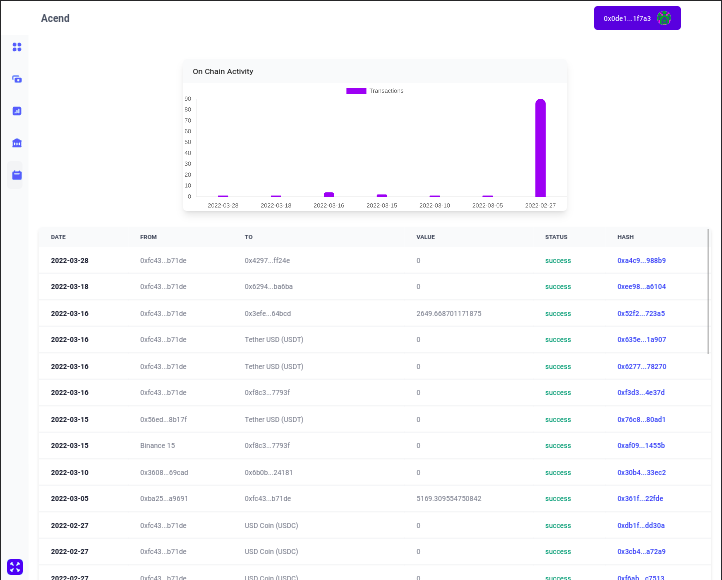

# klaytn-covalent unified hackathon

## project name: Acend

### description

Acend is a multi-chain dapp that allows  users to better manage and view their NFT assets across chains in a simple and very intuitive UI.

A multi-chain NFT dashboard that comes with more functionalities and great UI/UX.

You can receive and send your ERC721 token from the dashboard.

you can mint and/or create nft collections from the dashboard.

you can bridge your nft assets across chains (coming soon)

You can also view your transaction history across supporting chains. and track your onchain activity graphically.

- presentation slides: [here](https://www.canva.com/design/DAFBERyAsK8/C-8P-w_bg4M-tBIWLMgmYA/edit?utm_content=DAFBERyAsK8&utm_campaign=designshare&utm_medium=link2&utm_source=sharebutton)

- live demo: [acend.app](https://acend-klaytn.vercel.app/nft/)

- acendnft contract address: [nft contract](https://baobab.scope.klaytn.com/account/0x430D2080F463ac16911F0E4969FF010a0ecC7e98?tabId)

- minter contract address: [minter contract](https://baobab.scope.klaytn.com/account/0x6728cb8cb79fcAfEe4f8608030503eDC8621483b?tabId)

### screenshots

